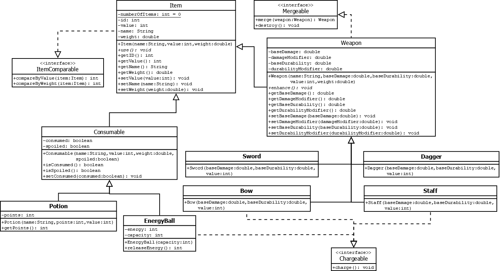

# Alchemy and Forging Game

This project is an implementation of an Alchemy and Forging Game based on the provided UML diagram. It involves implementing various classes and interfaces to create items, perform merging, and manage energy and charges. The problem was introduced by Sir Jomari Joseph Barera.

## UML Diagram




## Usage

To use this game, follow the instructions below:

1. Clone the repository to your local machine.

   ```
   git clone https://github.com/your-username/alchemy-forging-game.git
   ```

   Replace `your-username` with your GitHub username.

2. Import the necessary libraries and classes into your project.

3. Implement the required classes and interfaces based on the provided UML diagram and instructions.

4. Use the implemented classes and interfaces to create items, perform merging, and manage energy and charges within your game.

### Item


Implement the `Item` abstract class according to the provided UML diagram.

1. Declare the `numberOfItems` as a static variable with a default value of 0.

2. Declare the remaining attributes of the abstract class `Item` according to the UML.

3. Implement the constructor for the `Item` class:
   - Assign the `id` attribute with the current value of `numberOfItems`, then increment the value of `numberOfItems` variable.
   - Initialize the `value`, `name`, and `weight` attributes using their corresponding parameters.

4. Declare the abstract method `use` according to the UML specification.

5. Implement the getters and setters according to the UML specification.

6. Override the `compareByValue` method from the `ItemComparable` interface by returning the difference between the value of the current item and the parameter `i`.

7. Override the `compareByWeight` method from the `ItemComparable` interface by returning:
   - 1 if the weight of the current item is greater than the weight of item `i`.
   - -1 if the weight of the current item is less than the weight of item `i`.
   - 0 if the weight of the current item is equal to the weight of item `i`.

### Consumable

Implement the `Consumable` abstract class according to the provided UML diagram.

1. Declare the attributes of the abstract class `Consumable` according to the UML.

2. Implement the constructor for the `Consumable` class:
   - Call the constructor of the superclass to initialize the `name`, `value`, and `weight` based on the corresponding parameters.
   - Initialize the `spoiled` attribute with its corresponding parameter.
   - Initialize the `consumed` attribute with a default value of `false`.

3. Implement the getters and setters according to the UML specification.

### EnergyBall

Implement the `EnergyBall` class according to the provided UML diagram.

1. Declare the attributes of the class `EnergyBall` according to the UML.

2. Implement the constructor for the `EnergyBall` class:
   - Call the constructor of the superclass to initialize the `name` with "energy ball", `value` of 0, `weight` of 10, and `spoiled` by `false`.
   - Initialize the `capacity` attribute with its corresponding parameter.
   - Initialize the `energy` attribute with a default value of 0.

3. Implement the `releaseEnergy` method:
   - Return the current value of the energy and set the energy to 0.

4. Override the `charge` method from the `Chargeable` interface:
   - Increase the energy by 1 if the current energy is less than the capacity.
   - Print the statement "This energy ball is fully charged." if the current energy is equal to or greater than the capacity.

5. Override the `use` method from the `Item` abstract class:
   - Print the statement "This energy ball can't be used in this situation."

### ItemComparable

Implement the `ItemComparable` interface according to the provided UML diagram.

No implementation details are provided for this interface. It serves as a guide for classes that need to implement comparison methods based on item value and weight.

### Mergeable

Implement the `Mergeable` interface according to the provided UML diagram.

No implementation details are provided for this interface. It serves as a guide for classes that need to implement merging functionality.

### Chargeable

Implement the `Chargeable` interface according to the provided UML diagram.

No implementation details are provided for this interface. It serves as a guide for classes that need to implement charge-related functionality.

Please note that the specific code implementation for each class is not provided here. The provided instructions guide you on how to implement the classes based on the UML diagram and the desired behavior described in the instructions.

## Additional Classes

The following classes are included in this repository:

1. Sword: This class represents a sword item in the game. It provides methods for attacking and handling sword-specific functionalities.

2. Dagger: The Dagger class represents a dagger item. It contains methods for close-range attacks and dagger-specific actions.

3. Staff: The Staff class represents a magical staff used in the game. It includes methods for casting spells and performing staff-related actions.

4. Bow: This class represents a bow item. It provides functionality for long-range attacks and bow-related actions.

5. Potion: The Potion class represents a healing potion in the game. It contains methods for consuming the potion and healing the player.

6. Mergeable: The Mergeable interface represents an item that can be merged with other items. It provides methods for merging and handling mergeable items.

## Contributing

If you would like to contribute to this project, please follow these steps:

1. Fork the repository by clicking the "Fork" button on the top right corner of this page. This will create a copy of the repository in your GitHub account.

2. Clone the forked repository to your local machine.

   ```
   git clone https://github.com/your-username/alchemy-forging-game.git
   ```

   Replace `your-username` with your GitHub username.

3. Create a new branch for your changes. Use a descriptive name related to the feature or fix you are working on.

   ```
   git checkout -b feature/my-feature
   ```

4. Implement your changes, following the provided UML diagram and instructions.

5. Commit your changes with a descriptive commit message.

   ```
   git commit -m "Add feature or fix"
   ```

6. Push your changes to your forked repository.

   ```
   git push origin feature/my-feature
   ```

7. Open a pull request from your forked repository to the original repository. Provide a clear description of your changes and why they should be merged.

Once your pull request is reviewed and approved, it will be merged into the main project.

## Credits

This problem was introduced by Sir Jomari Joseph Barera, an instructor at VSU (Visayas State University). We acknowledge his contribution in presenting this problem for implementation.
